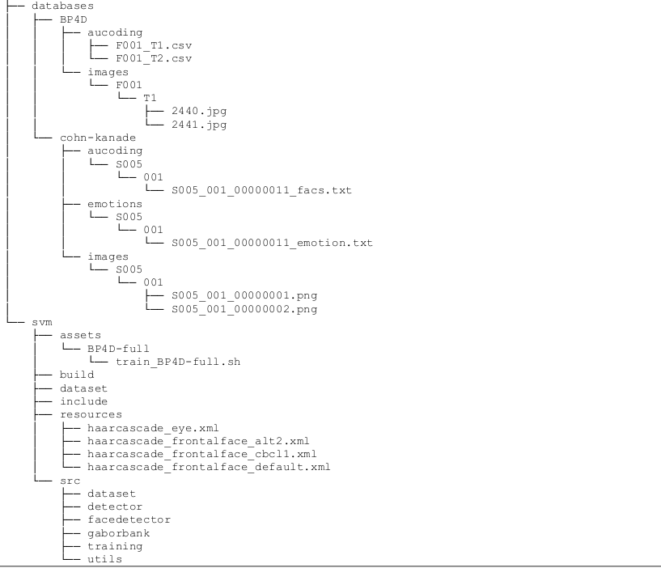

# Instructions to build code:

1) You need the following installed:
	GCC 4.7
	Cmake 2.8 (minimum)
	OpenCV 2.4.8
	Python 2.7
	Python Numpy library
	Python scipy library

2) Navigate to svm/build folders

3) Run CMake (enter the following):

>	cmake ..

4) Run Make (enter the following):

>	make

5) Install the SVM application (enter the following):

>	make install

6) To run the SVM classifier run one of the scripts supplied in the assets folders, e.g.:

>	cd ../assets/BP4D-full
>	sh train_BP4D-full.sh

Please check folder structure.png for required folder structure:

